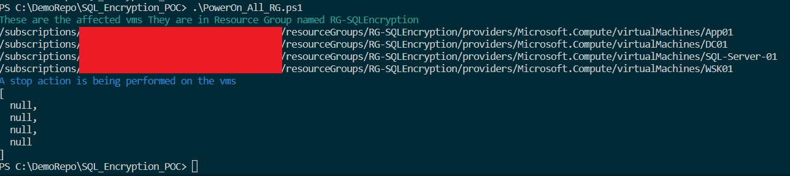

# PowerAllRG
This project documents a project that scripts the start and stop for all vms in an Azure Resource Group

The project uses a PowerShell Script to either start or stop all virtual machines in an Azure Resource Group.  The script has two variables.

Variables to declare

$RG="<resource group name>" 
  
$vm_action="<action type>" 
  
For $RG, enter the name of the resource grroup.  For $vm_action, it can either be start, or stop.

When it runs, the script will show a list of all of the vms in the resource group and display if the action is start or stop.

